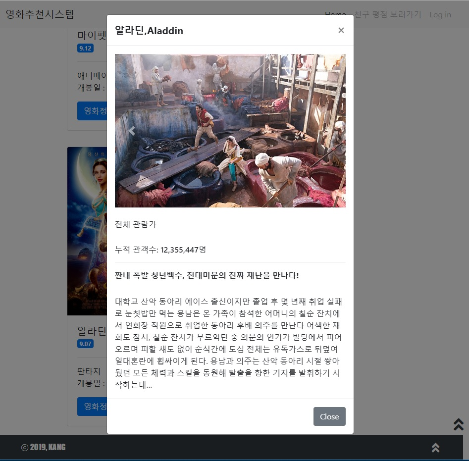

Project 4 - Web(반응형 웹 사이트 구성)

### |Project Goal

- HTML를 통한 웹 페이지 마크업
- CSS를 통한 선택자 활용 및 웹 페이지 꾸미기
- Bootstrap을 활용한 HTML/CSS, JS 라이브러리 활용
- 영화 추천 사이트 반응형 레이아웃 구성


### |Contents

- 영화 추천 사이트를 위한 레이아웃 구성 

  - 필수 사항
    - DOCTYPE 은 html입니다.
    - html 의 언어는 한국어(ko)입니다.
    - meta 태그에 인코딩 설정을 UTF-8로 설정 해주세요.
    - meta 태그에 기본 viewport 설정을 해주세요. (width: device-width, initial-scale: 1.0)
    - title 태그는 영화추천사이트 라고 설정 해주세요.
    
    
  
- Navigation Bar
  
- 필수 사항
  
    - 속성
  
      - 최상단에 위치해야합니다.
      - Item List(예시 - Home/친구평점보러가기/Login)는 우측 정렬입니다.
      - 반응형으로 구성되어 일정 수준 이하에서는 item이 숨김 처리 됩니다.
      - Sticky navigation bar로 구성됩니다.
  
      ```html
      <nav class="navbar fixed-top navbar-expand-sm navbar-light bg-light">
          <a class="navbar-brand" href="#">영화추천시스템</a>
          <button class="navbar-toggler" type="button" data-toggle="collapse" data-target="#navbarNavAltMarkup"
            aria-controls="navbarNavAltMarkup" aria-expanded="false" aria-label="Toggle navigation">
            <span class="navbar-toggler-icon"></span>
          </button>
          <div class="collapse navbar-collapse" id="navbarNavAltMarkup">
            <div class="navbar-nav ml-auto ">
              <a class="nav-item nav-link active" href="#">Home <span class="sr-only">(current)</span></a>
              <a class="nav-item nav-link disabled" href="#">친구 평점 보러가기</a>
              <a class="nav-item nav-link disabled" href="#">Log in</a>
            </div>
          </div>
       </nav>
      ```
  
  
  
  
- Header
  
- 필수사항
  
  - 속성
  
    - Navigation Bar 바로 아래에 위치합니다.
      - 높이는 350px , 너비는 브라우저 전체 영역입니다.
      - 이미지는 선택적으로 활용 가능하되 반드시 배경 이미지가 있어야 합니다.
  - Header 영역의 수직/수평 가운데 정렬 위치에 h2 태그를 사용하여 작성 해주세요.
    
      ```html
       <header>
          <div class="a">당신에게 어울리는 영화를<br>추천해드립니다.</div>
       </header>
      
      
      --- css------
      header {
    margin-top: 55px;
      height: 350px;
        background-color: darkgray;
      background-blend-mode: color-burn;
        background-image: url('images/header1.jpg');
        background-size: 100% 100%;
        background-position: center; 
        background-repeat: no-repeat;
      }
      
      .a {
        position: relative;
        top: 45%;
        bottom: 55%;
        left: -0.5%;
        font-size: 1.8vw;
        text-align: center;
        font-family: Georgia, 'Times New Roman', Times, serif;
        font-weight: bold;
      }
      ```
      
      
  
- Footer

  좌측 레이아웃에 장르 목록을 구성합니다.

  - 필수 사항
    - 속성

      - 브라우저 최하단에 위치합니다.
        옵션 중 선택 - 1) Sticky 2) 내용 최하단
      - 높이는 50px 이상, 너비는 브라우저 전체 영역입니다.
      - 왼쪽에는 본인의 이름 혹은 닉네임, 오른쪽에는 헤더로 올라가는 링크로 구성됩니다.
  - Footer는 padding이 좌우로 3rem
      
      ```html
      <footer class="bg-dark d-flex justify-content-between">
          <div class="footer_text text-white pl-5">
            <span>ⓒ 2019, KANG</span>
          </div>
          <a id="arrow1" class="pr-5" href="#">
            <i class="fas fa-angle-double-up text-white"></i>
          </a>
        </footer>
        
        
  ----css----
      footer {
        height: 50px;
        bottom: 0;
      }
      .footer_text {
        font-size: 1rem;
        font-family: Impact, Haettenschweiler, 'Arial Narrow Bold', sans-serif;
        line-height: 50px;
      }
      #arrow1 {
        font-size: 1.5rem;
        line-height: 50px;
      }
      
      ```
      
      

- Card view
  
- 필수 사항
  
  - 카드 총 6개 이상이며, 반응형으로 배치해야 합니다.
  - 한 줄에 보이는 카드의 갯수는 다음과 같이 구성됩니다.
  - 576px 미만 : 1개
      - 576px 이상 768px 미만 : 2개
      - 768px 이상 992px 미만 : 3개
    - 992px 이상 : 4개
  
    - 카드는 각각 위 아래 margin이 1rem입니다.
  
  ```html
  <div class="container">
        <div class="row">
          <div class="px-0.3">
            <div class="square col-12 col-sm-6 col-md-4 col-lg-3 my-3">
              <div class="card " style="width: 15rem;">
                
              <div class="card-body">
                  <h5 class="card-title mb-0">엑시트</h5>
                  <span class="badge badge-primary">9.07</span>
                  <hr>
                  <p class="card-text">코미디 <br>개봉일 : 2019.07.31</p>
                  <a href="#" class="btn btn-primary">영화정보 보러가기</a>
                </div>
              </div>
            </div>
          </div>
  ```
  
- Modal

  - 필수 사항

    이미지를 클릭하면, 영화에 대한 상세 정보와 추가 이미지를 보여 주도록 구성 해봅시다.

    - Modal의 상단(.modal-header .modal-title)에는 영화의 한글명과 영문명을 같이 작성해 주세요.
    - Modal의 헤더(.modal-header)와 내용(.modal-body) 사이에 이미지를 삽입 해주세요.

  ```html
  <button type="button" class="btn btn-primary" data-toggle="modal" data-target="#exampleModalScrollable">
                    영화정보 보러가기
                  </button>
                  <!-- Modal -->
                  <div class="modal fade" id="exampleModalScrollable" tabindex="-1" role="dialog"
                    aria-labelledby="exampleModalScrollableTitle" aria-hidden="true">
                    <div class="modal-dialog modal-dialog-scrollable" role="document">
                      <div class="modal-content">
                        <div class="modal-header">
                          <h5 class="modal-title" id="exampleModalScrollableTitle"><strong>엑시트,EXIT</strong></h5>
                          <button type="button" class="close" data-dismiss="modal" aria-label="Close">
                            <span aria-hidden="true">&times;</span>
                          </button>
                        </div>
                        <div class="modal-body">
                          <div id="carouselExampleControls" class="carousel slide" data-ride="carousel">
                            <div class="carousel-inner">
                              <div class="carousel-item active">
                                
                              </div>
                              <div class="carousel-item">
                                
                              </div>
                              <div class="carousel-item">
                                
                              </div>
                            </div>
                            <a class="carousel-control-prev" href="#carouselExampleControls" role="button"
                              data-slide="prev">
                              <span class="carousel-control-prev-icon" aria-hidden="true"></span>
                              <span class="sr-only">Previous</span>
                            </a>
                            <a class="carousel-control-next" href="#carouselExampleControls" role="button"
                              data-slide="next">
                              <span class="carousel-control-next-icon" aria-hidden="true"></span>
                              <span class="sr-only">Next</span>
                            </a>
                          </div>
                          <!--  -->
                          <div>
                            <br>
                            <h6>12세 이상 관람가</h6>
                            <br>
                            <h6>누적 관객수: 2,962,455명</h6>
                            <hr>
                            <h6><strong>짠내 폭발 청년백수, 전대미문의 진짜 재난을 만나다!</strong> </h6>
                            <br>
                            대학교 산악 동아리 에이스 출신이지만
                            졸업 후 몇 년째 취업 실패로 눈칫밥만 먹는 용남은
                            온 가족이 참석한 어머니의 칠순 잔치에서
                            연회장 직원으로 취업한 동아리 후배 의주를 만난다
                            어색한 재회도 잠시, 칠순 잔치가 무르익던 중
                            의문의 연기가 빌딩에서 피어 오르며
                            피할 새도 없이 순식간에 도심 전체는 유독가스로 뒤덮여 일대혼란에 휩싸이게 된다.
                            용남과 의주는 산악 동아리 시절 쌓아 뒀던 모든 체력과 스킬을 동원해
                            탈출을 향한 기지를 발휘하기 시작하는데…
                          </div>
                        </div>
                        <div class="modal-footer">
                          <button type="button" class="btn btn-secondary" data-dismiss="modal">Close</button>
                        </div>
                      </div>
                    </div>
                  </div>
  ```

  

  

### |Result



